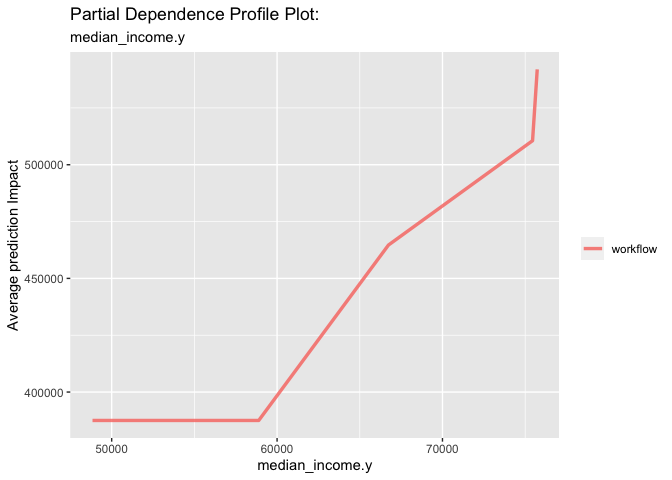
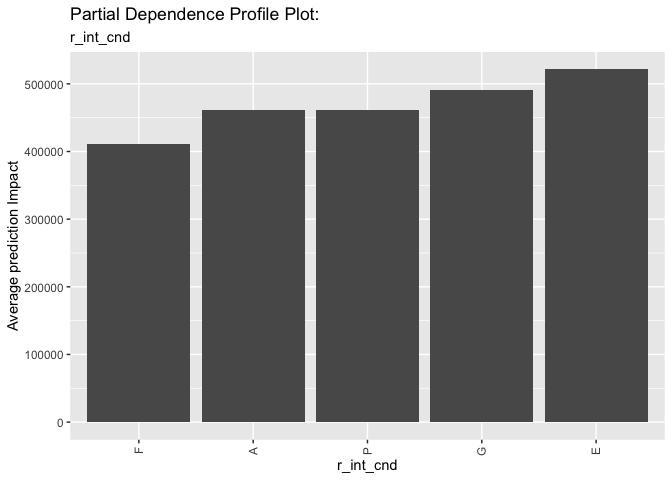
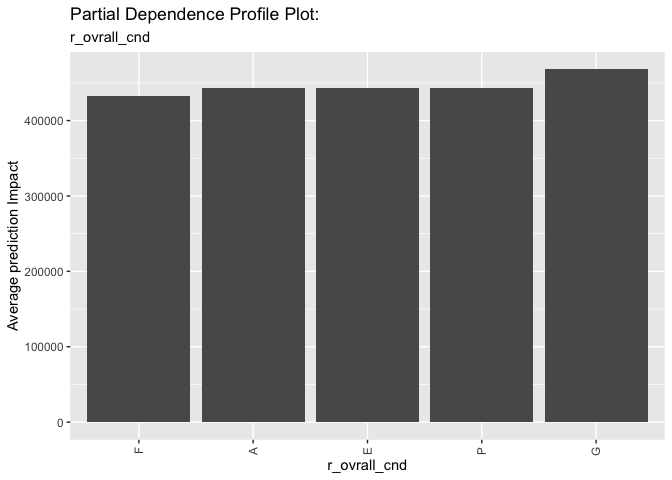

Explain Regression Predictoins with Challenge 3
================
Nicole An
2022-12-17

Read: <https://www.tmwr.org/explain.html#local-explanations>

## Load Packages

``` r
options (scipen = 999)
library(tidyverse)
library(tidymodels)
library(janitor)
library(skimr)
library(vip)
library(DALEX)    # new
library(DALEXtra) # new
```

## Load Data

``` r
boston <- read_csv("boston_train.csv") %>% clean_names()
```

    ## Rows: 9959 Columns: 33
    ## ── Column specification ────────────────────────────────────────────────────────
    ## Delimiter: ","
    ## chr (16): own_occ, structure_class, r_bldg_styl, r_roof_typ, r_ext_fin, r_bt...
    ## dbl (17): pid, zipcode, av_total, land_sf, yr_built, yr_remod, living_area, ...
    ## 
    ## ℹ Use `spec()` to retrieve the full column specification for this data.
    ## ℹ Specify the column types or set `show_col_types = FALSE` to quiet this message.

``` r
zips   <- read_csv("zips.csv") %>% clean_names()
```

    ## Rows: 6 Columns: 5
    ## ── Column specification ────────────────────────────────────────────────────────
    ## Delimiter: ","
    ## chr (2): ZIP, City_State
    ## dbl (3): Population, Pop_Density, Median_Income
    ## 
    ## ℹ Use `spec()` to retrieve the full column specification for this data.
    ## ℹ Specify the column types or set `show_col_types = FALSE` to quiet this message.

``` r
head(boston)
```

    ## # A tibble: 6 × 33
    ##     pid zipcode own_occ av_total land_sf yr_bu…¹ yr_re…² livin…³ num_f…⁴ struc…⁵
    ##   <dbl>   <dbl> <chr>      <dbl>   <dbl>   <dbl>   <dbl>   <dbl>   <dbl> <chr>  
    ## 1    10    2136 Y         321200   10288    1992       0    1681     1   R      
    ## 2    40    2124 Y         450500    3187    1900    2001    1868     2   R      
    ## 3    70    2130 Y         794300    6007    1962    2001    2146     2   R      
    ## 4    80    2136 Y         342100    5500    1949    2002    1357     1.5 R      
    ## 5    90    2124 Y         444700    3026    1900       0    2346     2.5 R      
    ## 6   100    2131 Y         518500    4950    1900    2012    2032     2   R      
    ## # … with 23 more variables: r_bldg_styl <chr>, r_roof_typ <chr>,
    ## #   r_ext_fin <chr>, r_total_rms <dbl>, r_bdrms <dbl>, r_full_bth <dbl>,
    ## #   r_half_bth <dbl>, r_bth_style <chr>, r_kitch <dbl>, r_kitch_style <chr>,
    ## #   r_heat_typ <chr>, r_ac <chr>, r_fplace <dbl>, r_ext_cnd <chr>,
    ## #   r_ovrall_cnd <chr>, r_int_cnd <chr>, r_int_fin <chr>, r_view <chr>,
    ## #   zip <chr>, population <dbl>, pop_density <dbl>, median_income <dbl>,
    ## #   city_state <chr>, and abbreviated variable names ¹​yr_built, ²​yr_remod, …

``` r
head(zips)
```

    ## # A tibble: 6 × 5
    ##   zip   population pop_density median_income city_state           
    ##   <chr>      <dbl>       <dbl>         <dbl> <chr>                
    ## 1 02132      36314       13251         75446 Cambridge, MA        
    ## 2 02124      47783       15913         48841 Dorchester Center, MA
    ## 3 02131      29826       11505         66735 Roslindale, MA       
    ## 4 02136      28488        6207         58890 Hyde Park, MA        
    ## 5 02130      35401       10618         75730 Jamaica Plain, MA    
    ## 6 02138      36314       13251         75446 Cambridge, MA

``` r
boston %>% skim()
```

|                                                  |            |
|:-------------------------------------------------|:-----------|
| Name                                             | Piped data |
| Number of rows                                   | 9959       |
| Number of columns                                | 33         |
| \_\_\_\_\_\_\_\_\_\_\_\_\_\_\_\_\_\_\_\_\_\_\_   |            |
| Column type frequency:                           |            |
| character                                        | 16         |
| numeric                                          | 17         |
| \_\_\_\_\_\_\_\_\_\_\_\_\_\_\_\_\_\_\_\_\_\_\_\_ |            |
| Group variables                                  | None       |

Data summary

**Variable type: character**

| skim_variable   | n_missing | complete_rate | min | max | empty | n_unique | whitespace |
|:----------------|----------:|--------------:|----:|----:|------:|---------:|-----------:|
| own_occ         |         0 |             1 |   1 |   1 |     0 |        2 |          0 |
| structure_class |         0 |             1 |   1 |   1 |     0 |        1 |          0 |
| r_bldg_styl     |         0 |             1 |   2 |   2 |     0 |       16 |          0 |
| r_roof_typ      |         0 |             1 |   1 |   1 |     0 |        7 |          0 |
| r_ext_fin       |         0 |             1 |   1 |   1 |     0 |       10 |          0 |
| r_bth_style     |         0 |             1 |   1 |   1 |     0 |        4 |          0 |
| r_kitch_style   |         0 |             1 |   1 |   1 |     0 |        4 |          0 |
| r_heat_typ      |         0 |             1 |   1 |   1 |     0 |        7 |          0 |
| r_ac            |         0 |             1 |   1 |   1 |     0 |        3 |          0 |
| r_ext_cnd       |         0 |             1 |   1 |   1 |     0 |        5 |          0 |
| r_ovrall_cnd    |         0 |             1 |   1 |   1 |     0 |        5 |          0 |
| r_int_cnd       |         0 |             1 |   1 |   1 |     0 |        5 |          0 |
| r_int_fin       |         0 |             1 |   1 |   1 |     0 |        2 |          0 |
| r_view          |         0 |             1 |   1 |   1 |     0 |        5 |          0 |
| zip             |         0 |             1 |   5 |   5 |     0 |        5 |          0 |
| city_state      |         0 |             1 |  13 |  21 |     0 |        5 |          0 |

**Variable type: numeric**

| skim_variable | n_missing | complete_rate |      mean |        sd |     p0 |      p25 |    p50 |    p75 |    p100 | hist  |
|:--------------|----------:|--------------:|----------:|----------:|-------:|---------:|-------:|-------:|--------:|:------|
| pid           |         0 |          1.00 |  71093.60 |  41011.82 |     10 |  35780.0 |  71180 | 106575 |  142240 | ▇▇▇▇▇ |
| zipcode       |         0 |          1.00 |   2131.45 |      3.69 |   2124 |   2131.0 |   2132 |   2132 |    2136 | ▃▁▆▇▆ |
| av_total      |         0 |          1.00 | 448563.64 | 147761.17 | 134800 | 347100.0 | 418700 | 510150 | 1097100 | ▂▇▂▁▁ |
| land_sf       |         0 |          1.00 |   5936.18 |   2954.01 |    920 |   4319.0 |   5320 |   6756 |  107158 | ▇▁▁▁▁ |
| yr_built      |         0 |          1.00 |   1933.40 |     35.28 |      0 |   1910.0 |   1931 |   1955 |    2016 | ▁▁▁▁▇ |
| yr_remod      |       347 |          0.97 |    675.71 |    946.59 |      0 |      0.0 |      0 |   1997 |    2016 | ▇▁▁▁▅ |
| living_area   |         0 |          1.00 |   1659.00 |    545.95 |    332 |   1300.0 |   1554 |   1914 |    8623 | ▇▂▁▁▁ |
| num_floors    |         0 |          1.00 |      1.73 |      0.45 |      1 |      1.5 |      2 |      2 |       3 | ▃▂▇▁▁ |
| r_total_rms   |         0 |          1.00 |      7.11 |      1.55 |      3 |      6.0 |      7 |      8 |      17 | ▁▇▂▁▁ |
| r_bdrms       |         0 |          1.00 |      3.34 |      0.92 |      0 |      3.0 |      3 |      4 |       9 | ▁▇▃▁▁ |
| r_full_bth    |         0 |          1.00 |      1.35 |      0.56 |      1 |      1.0 |      1 |      2 |       6 | ▇▁▁▁▁ |
| r_half_bth    |         0 |          1.00 |      0.56 |      0.55 |      0 |      0.0 |      1 |      1 |      10 | ▇▁▁▁▁ |
| r_kitch       |         0 |          1.00 |      1.02 |      0.14 |      1 |      1.0 |      1 |      1 |       3 | ▇▁▁▁▁ |
| r_fplace      |         0 |          1.00 |      0.60 |      0.62 |      0 |      0.0 |      1 |      1 |       5 | ▇▁▁▁▁ |
| population    |         0 |          1.00 |  34871.56 |   6299.30 |  28488 |  29826.0 |  35401 |  36314 |   47783 | ▇▂▆▁▃ |
| pop_density   |         0 |          1.00 |  11368.99 |   3293.58 |   6207 |  10618.0 |  11505 |  13251 |   15913 | ▆▁▆▇▃ |
| median_income |         0 |          1.00 |  65984.07 |   9749.72 |  48841 |  58890.0 |  66735 |  75446 |   75730 | ▃▅▁▃▇ |

## Make Factors & Drop

``` r
zips <- zips %>%
  mutate(zip = as.integer(zip))

# I filled na values in land_sf with the mean value, and na values in yr_remod with 0. Now there is no null value.
bos <- boston %>%
  left_join(zips, by = c("zipcode" = "zip")) %>%
  select(-pid) %>%
  mutate(land_sf = replace_na(land_sf,mean(land_sf,na.rm=T))) %>%
  mutate(yr_remod = replace_na(yr_remod,0)) %>%
  mutate(remod_yes = as.factor(ifelse(yr_remod == 0,0,1))) %>%
  mutate(home_age = if_else(yr_remod > yr_built, 2022 - yr_remod, 2022 - yr_built)) %>%
  mutate_if(is.character,factor)

head(bos,5)
```

    ## # A tibble: 5 × 38
    ##   zipcode own_occ av_total land_sf yr_built yr_remod living_area num_f…¹ struc…²
    ##     <dbl> <fct>      <dbl>   <dbl>    <dbl>    <dbl>       <dbl>   <dbl> <fct>  
    ## 1    2136 Y         321200   10288     1992        0        1681     1   R      
    ## 2    2124 Y         450500    3187     1900     2001        1868     2   R      
    ## 3    2130 Y         794300    6007     1962     2001        2146     2   R      
    ## 4    2136 Y         342100    5500     1949     2002        1357     1.5 R      
    ## 5    2124 Y         444700    3026     1900        0        2346     2.5 R      
    ## # … with 29 more variables: r_bldg_styl <fct>, r_roof_typ <fct>,
    ## #   r_ext_fin <fct>, r_total_rms <dbl>, r_bdrms <dbl>, r_full_bth <dbl>,
    ## #   r_half_bth <dbl>, r_bth_style <fct>, r_kitch <dbl>, r_kitch_style <fct>,
    ## #   r_heat_typ <fct>, r_ac <fct>, r_fplace <dbl>, r_ext_cnd <fct>,
    ## #   r_ovrall_cnd <fct>, r_int_cnd <fct>, r_int_fin <fct>, r_view <fct>,
    ## #   zip <fct>, population.x <dbl>, pop_density.x <dbl>, median_income.x <dbl>,
    ## #   city_state.x <fct>, population.y <dbl>, pop_density.y <dbl>, …

``` r
bos %>% skim()
```

|                                                  |            |
|:-------------------------------------------------|:-----------|
| Name                                             | Piped data |
| Number of rows                                   | 9959       |
| Number of columns                                | 38         |
| \_\_\_\_\_\_\_\_\_\_\_\_\_\_\_\_\_\_\_\_\_\_\_   |            |
| Column type frequency:                           |            |
| factor                                           | 18         |
| numeric                                          | 20         |
| \_\_\_\_\_\_\_\_\_\_\_\_\_\_\_\_\_\_\_\_\_\_\_\_ |            |
| Group variables                                  | None       |

Data summary

**Variable type: factor**

| skim_variable   | n_missing | complete_rate | ordered | n_unique | top_counts                                 |
|:----------------|----------:|--------------:|:--------|---------:|:-------------------------------------------|
| own_occ         |         0 |             1 | FALSE   |        2 | Y: 8785, N: 1174                           |
| structure_class |         0 |             1 | FALSE   |        1 | R: 9959                                    |
| r_bldg_styl     |         0 |             1 | FALSE   |       16 | CL: 5957, CP: 1637, RN: 717, BW: 487       |
| r_roof_typ      |         0 |             1 | FALSE   |        7 | G: 7839, H: 1354, L: 526, M: 108           |
| r_ext_fin       |         0 |             1 | FALSE   |       10 | M: 5433, W: 2761, F: 753, A: 429           |
| r_bth_style     |         0 |             1 | FALSE   |        4 | S: 6563, M: 2760, N: 614, L: 22            |
| r_kitch_style   |         0 |             1 | FALSE   |        4 | S: 5900, M: 3387, N: 627, L: 45            |
| r_heat_typ      |         0 |             1 | FALSE   |        7 | W: 7304, F: 2475, E: 127, P: 25            |
| r_ac            |         0 |             1 | FALSE   |        3 | N: 8289, C: 1626, D: 44                    |
| r_ext_cnd       |         0 |             1 | FALSE   |        5 | A: 8112, G: 1582, F: 251, P: 12            |
| r_ovrall_cnd    |         0 |             1 | FALSE   |        5 | A: 8243, G: 1632, F: 76, P: 7              |
| r_int_cnd       |         0 |             1 | FALSE   |        5 | A: 7133, G: 2684, F: 122, E: 12            |
| r_int_fin       |         0 |             1 | FALSE   |        2 | N: 9952, E: 7                              |
| r_view          |         0 |             1 | FALSE   |        5 | A: 9358, G: 316, F: 264, E: 11             |
| zip             |         0 |             1 | FALSE   |        5 | 021: 3409, 021: 2445, 021: 1726, 021: 1465 |
| city_state.x    |         0 |             1 | FALSE   |        5 | Cam: 3409, Hyd: 2445, Ros: 1726, Dor: 1465 |
| city_state.y    |         0 |             1 | FALSE   |        5 | Cam: 3409, Hyd: 2445, Ros: 1726, Dor: 1465 |
| remod_yes       |         0 |             1 | FALSE   |        2 | 0: 6714, 1: 3245                           |

**Variable type: numeric**

| skim_variable   | n_missing | complete_rate |      mean |        sd |     p0 |      p25 |    p50 |    p75 |    p100 | hist  |
|:----------------|----------:|--------------:|----------:|----------:|-------:|---------:|-------:|-------:|--------:|:------|
| zipcode         |         0 |             1 |   2131.45 |      3.69 |   2124 |   2131.0 |   2132 |   2132 |    2136 | ▃▁▆▇▆ |
| av_total        |         0 |             1 | 448563.64 | 147761.17 | 134800 | 347100.0 | 418700 | 510150 | 1097100 | ▂▇▂▁▁ |
| land_sf         |         0 |             1 |   5936.18 |   2954.01 |    920 |   4319.0 |   5320 |   6756 |  107158 | ▇▁▁▁▁ |
| yr_built        |         0 |             1 |   1933.40 |     35.28 |      0 |   1910.0 |   1931 |   1955 |    2016 | ▁▁▁▁▇ |
| yr_remod        |         0 |             1 |    652.17 |    938.17 |      0 |      0.0 |      0 |   1995 |    2016 | ▇▁▁▁▃ |
| living_area     |         0 |             1 |   1659.00 |    545.95 |    332 |   1300.0 |   1554 |   1914 |    8623 | ▇▂▁▁▁ |
| num_floors      |         0 |             1 |      1.73 |      0.45 |      1 |      1.5 |      2 |      2 |       3 | ▃▂▇▁▁ |
| r_total_rms     |         0 |             1 |      7.11 |      1.55 |      3 |      6.0 |      7 |      8 |      17 | ▁▇▂▁▁ |
| r_bdrms         |         0 |             1 |      3.34 |      0.92 |      0 |      3.0 |      3 |      4 |       9 | ▁▇▃▁▁ |
| r_full_bth      |         0 |             1 |      1.35 |      0.56 |      1 |      1.0 |      1 |      2 |       6 | ▇▁▁▁▁ |
| r_half_bth      |         0 |             1 |      0.56 |      0.55 |      0 |      0.0 |      1 |      1 |      10 | ▇▁▁▁▁ |
| r_kitch         |         0 |             1 |      1.02 |      0.14 |      1 |      1.0 |      1 |      1 |       3 | ▇▁▁▁▁ |
| r_fplace        |         0 |             1 |      0.60 |      0.62 |      0 |      0.0 |      1 |      1 |       5 | ▇▁▁▁▁ |
| population.x    |         0 |             1 |  34871.56 |   6299.30 |  28488 |  29826.0 |  35401 |  36314 |   47783 | ▇▂▆▁▃ |
| pop_density.x   |         0 |             1 |  11368.99 |   3293.58 |   6207 |  10618.0 |  11505 |  13251 |   15913 | ▆▁▆▇▃ |
| median_income.x |         0 |             1 |  65984.07 |   9749.72 |  48841 |  58890.0 |  66735 |  75446 |   75730 | ▃▅▁▃▇ |
| population.y    |         0 |             1 |  34871.56 |   6299.30 |  28488 |  29826.0 |  35401 |  36314 |   47783 | ▇▂▆▁▃ |
| pop_density.y   |         0 |             1 |  11368.99 |   3293.58 |   6207 |  10618.0 |  11505 |  13251 |   15913 | ▆▁▆▇▃ |
| median_income.y |         0 |             1 |  65984.07 |   9749.72 |  48841 |  58890.0 |  66735 |  75446 |   75730 | ▃▅▁▃▇ |
| home_age        |         0 |             1 |     63.80 |     39.80 |      6 |     22.0 |     67 |     97 |     297 | ▇▇▁▁▁ |

## XGboost Recipe

### You’ll want to use K-Fold CV going forward.

``` r
# -- set a random seed for repeatably 
set.seed(43)

# -- performs our train / test split 
split <- initial_split(bos, prop = 0.8)

# -- extract the training data form our banana split 
train <- training(split)
# -- extract the test data 
test <- testing(split)

sprintf("Train PCT : %1.2f%%", nrow(train)/ nrow(bos) * 100)
```

    ## [1] "Train PCT : 80.00%"

``` r
sprintf("Test  PCT : %1.2f%%", nrow(test)/ nrow(bos) * 100)
```

    ## [1] "Test  PCT : 20.00%"

``` r
# -- this is all you need for tuning hyperparameters 
train_cv_folds <- vfold_cv(train, v=10)
train_cv_folds
```

    ## #  10-fold cross-validation 
    ## # A tibble: 10 × 2
    ##    splits             id    
    ##    <list>             <chr> 
    ##  1 <split [7170/797]> Fold01
    ##  2 <split [7170/797]> Fold02
    ##  3 <split [7170/797]> Fold03
    ##  4 <split [7170/797]> Fold04
    ##  5 <split [7170/797]> Fold05
    ##  6 <split [7170/797]> Fold06
    ##  7 <split [7170/797]> Fold07
    ##  8 <split [7171/796]> Fold08
    ##  9 <split [7171/796]> Fold09
    ## 10 <split [7171/796]> Fold10

# – the tough part

``` r
# -- define recipe 
xgb_recipe <- recipe(av_total ~ own_occ+land_sf+home_age+   yr_remod+living_area+   num_floors+structure_class+ r_bldg_styl+    r_roof_typ+ r_ext_fin+  r_total_rms+r_bdrms+r_full_bth+r_half_bth+r_bth_style+r_kitch+r_kitch_style+r_heat_typ+r_ac+    r_fplace+   r_ext_cnd+  r_ovrall_cnd+   r_int_cnd   +r_int_fin+ r_view+ population.y+   pop_density.y+median_income.y+city_state.y+remod_yes, data = train) %>%
  step_novel(all_nominal_predictors())%>%
  step_nzv(all_predictors()) %>%
  #step_other(all_nominal_predictors(), threshold = 0.01) %>%
  step_impute_mean(all_numeric_predictors()) %>%
  step_impute_mode(all_nominal_predictors()) %>%
  step_dummy(all_nominal_predictors())

## Check the recipe results m
bake(xgb_recipe %>% prep(),train %>% sample_n(1000))
```

    ## # A tibble: 1,000 × 88
    ##    land_sf home_age living_area num_fl…¹ r_tot…² r_bdrms r_ful…³ r_hal…⁴ r_fpl…⁵
    ##      <dbl>    <dbl>       <dbl>    <dbl>   <dbl>   <dbl>   <dbl>   <dbl>   <dbl>
    ##  1    8000      166        1485      2         7       3       1       0       0
    ##  2    3185      132        1689      2         8       3       1       0       0
    ##  3    6157       18        1620      2         6       3       1       0       1
    ##  4   13532       25        1800      2         8       4       2       1       1
    ##  5    5500       82        1427      1         6       2       1       0       1
    ##  6    4945       10        2302      2         7       3       2       1       0
    ##  7    8318        6        1306      1.5       6       3       2       0       1
    ##  8    5000      117        1288      2         6       3       1       0       0
    ##  9    2016       31        1350      2         5       3       2       0       0
    ## 10    4606       27        1440      2         6       3       2       0       0
    ## # … with 990 more rows, 79 more variables: population.y <dbl>,
    ## #   pop_density.y <dbl>, median_income.y <dbl>, av_total <dbl>,
    ## #   own_occ_Y <int>, own_occ_new <int>, r_bldg_styl_BW <int>,
    ## #   r_bldg_styl_CL <int>, r_bldg_styl_CN <int>, r_bldg_styl_CP <int>,
    ## #   r_bldg_styl_CV <int>, r_bldg_styl_OT <int>, r_bldg_styl_RE <int>,
    ## #   r_bldg_styl_RM <int>, r_bldg_styl_RN <int>, r_bldg_styl_RR <int>,
    ## #   r_bldg_styl_SD <int>, r_bldg_styl_SL <int>, r_bldg_styl_TD <int>, …

``` r
xgb_model <- boost_tree(
  trees = tune(), 
  tree_depth = tune(),       ## how deep of a tree, model complexity
  min_n = tune(),            ## minimum number of observations
) %>% 
  set_engine("xgboost") %>% 
  set_mode("regression")

xgb_model
```

    ## Boosted Tree Model Specification (regression)
    ## 
    ## Main Arguments:
    ##   trees = tune()
    ##   min_n = tune()
    ##   tree_depth = tune()
    ## 
    ## Computational engine: xgboost

``` r
# -- setup workflow 
xgb_workflow <- workflow() %>%
  add_recipe(xgb_recipe) %>%
  add_model(xgb_model) 

# -- setup your tuning grid -- random  
tune_grid <- grid_random( trees(c(10,100)),
                          tree_depth(),
                          min_n(),
                          size = 5)
print(tune_grid)
```

    ## # A tibble: 5 × 3
    ##   trees tree_depth min_n
    ##   <int>      <int> <int>
    ## 1    82          6     9
    ## 2    35         10     6
    ## 3    76          5     7
    ## 4    58          9    23
    ## 5    48          9    37

``` r
# -- setup parallel process 

# -- train!! K times for each parameter -- 
xgb_tuning_results <- xgb_workflow %>% 
  tune_grid(
    resamples = train_cv_folds,
    grid = tune_grid,
    control = control_resamples(save_pred = TRUE)
    )

xgb_tuning_results
```

    ## # Tuning results
    ## # 10-fold cross-validation 
    ## # A tibble: 10 × 5
    ##    splits             id     .metrics          .notes           .predictions
    ##    <list>             <chr>  <list>            <list>           <list>      
    ##  1 <split [7170/797]> Fold01 <tibble [10 × 7]> <tibble [0 × 3]> <tibble>    
    ##  2 <split [7170/797]> Fold02 <tibble [10 × 7]> <tibble [0 × 3]> <tibble>    
    ##  3 <split [7170/797]> Fold03 <tibble [10 × 7]> <tibble [0 × 3]> <tibble>    
    ##  4 <split [7170/797]> Fold04 <tibble [10 × 7]> <tibble [0 × 3]> <tibble>    
    ##  5 <split [7170/797]> Fold05 <tibble [10 × 7]> <tibble [0 × 3]> <tibble>    
    ##  6 <split [7170/797]> Fold06 <tibble [10 × 7]> <tibble [0 × 3]> <tibble>    
    ##  7 <split [7170/797]> Fold07 <tibble [10 × 7]> <tibble [0 × 3]> <tibble>    
    ##  8 <split [7171/796]> Fold08 <tibble [10 × 7]> <tibble [0 × 3]> <tibble>    
    ##  9 <split [7171/796]> Fold09 <tibble [10 × 7]> <tibble [0 × 3]> <tibble>    
    ## 10 <split [7171/796]> Fold10 <tibble [10 × 7]> <tibble [0 × 3]> <tibble>

## Review Tuning Results

``` r
## -- results of tuning -- 
xgb_tuning_results %>% 
  collect_metrics() %>%
  mutate_if(is.numeric, round,3) %>% 
  pivot_wider(names_from = .metric, values_from=c(mean, std_err))
```

    ## # A tibble: 5 × 10
    ##   trees min_n tree_depth .estima…¹     n .config mean_…² mean_…³ std_e…⁴ std_e…⁵
    ##   <dbl> <dbl>      <dbl> <chr>     <dbl> <chr>     <dbl>   <dbl>   <dbl>   <dbl>
    ## 1    76     7          5 standard     10 Prepro…  53990.   0.867   1041.   0.004
    ## 2    82     9          6 standard     10 Prepro…  53823.   0.868    829.   0.003
    ## 3    58    23          9 standard     10 Prepro…  54273.   0.866    775.   0.003
    ## 4    48    37          9 standard     10 Prepro…  54871.   0.863    944.   0.003
    ## 5    35     6         10 standard     10 Prepro…  55368.   0.861    906.   0.004
    ## # … with abbreviated variable names ¹​.estimator, ²​mean_rmse, ³​mean_rsq,
    ## #   ⁴​std_err_rmse, ⁵​std_err_rsq

## Visualize impact

``` r
## - visualize 

xgb_tuning_results %>%
  collect_metrics() %>%
  mutate_if(is.numeric, round,3) %>%
  ggplot(aes(trees, mean, )) +
  geom_line(size = 1.5, alpha = 0.6) +
  geom_point(size = 2) +
  facet_wrap(~ .metric, scales = "free", nrow = 2) 
```

<!-- -->

``` r
xgb_tuning_results %>%
  collect_metrics() %>%
  mutate_if(is.numeric, round,3) %>%
  ggplot(aes(tree_depth, mean, )) +
  geom_line(size = 1.5, alpha = 0.6) +
  geom_point(size = 2) +
  facet_wrap(~ .metric, scales = "free", nrow = 2) 
```

<!-- -->

``` r
xgb_tuning_results %>%
  collect_metrics()  %>%
  mutate_if(is.numeric, round,3) %>%
  ggplot(aes(min_n, mean, )) +
  geom_line(size = 1.5, alpha = 0.6) +
  geom_point(size = 2) +
  facet_wrap(~ .metric, scales = "free", nrow = 2) 
```

<!-- -->

## results

selecting “best” parameters

``` r
xgb_tuning_results %>%
  show_best("rsq") %>%
  print()
```

    ## # A tibble: 5 × 9
    ##   trees min_n tree_depth .metric .estimator  mean     n std_err .config         
    ##   <int> <int>      <int> <chr>   <chr>      <dbl> <int>   <dbl> <chr>           
    ## 1    82     9          6 rsq     standard   0.868    10 0.00312 Preprocessor1_M…
    ## 2    76     7          5 rsq     standard   0.867    10 0.00439 Preprocessor1_M…
    ## 3    58    23          9 rsq     standard   0.866    10 0.00293 Preprocessor1_M…
    ## 4    48    37          9 rsq     standard   0.863    10 0.00344 Preprocessor1_M…
    ## 5    35     6         10 rsq     standard   0.861    10 0.00375 Preprocessor1_M…

``` r
xgb_best <- xgb_tuning_results %>%
  select_best("rsq") 

print(xgb_best)
```

    ## # A tibble: 1 × 4
    ##   trees min_n tree_depth .config             
    ##   <int> <int>      <int> <chr>               
    ## 1    82     9          6 Preprocessor1_Model2

## refitting workflow with “best” parameters

``` r
xgb_final_wf <- xgb_workflow %>% 
  finalize_workflow(xgb_best)

print(xgb_final_wf)
```

    ## ══ Workflow ════════════════════════════════════════════════════════════════════
    ## Preprocessor: Recipe
    ## Model: boost_tree()
    ## 
    ## ── Preprocessor ────────────────────────────────────────────────────────────────
    ## 5 Recipe Steps
    ## 
    ## • step_novel()
    ## • step_nzv()
    ## • step_impute_mean()
    ## • step_impute_mode()
    ## • step_dummy()
    ## 
    ## ── Model ───────────────────────────────────────────────────────────────────────
    ## Boosted Tree Model Specification (regression)
    ## 
    ## Main Arguments:
    ##   trees = 82
    ##   min_n = 9
    ##   tree_depth = 6
    ## 
    ## Computational engine: xgboost

``` r
xgb_final_fit  <- xgb_final_wf %>%
  fit(data = train) 
```

## Global Interpretablity

``` r
xgb_final_fit %>% 
  pull_workflow_fit() %>% 
  vip(20)
```

    ## Warning: `pull_workflow_fit()` was deprecated in workflows 0.2.3.
    ## ℹ Please use `extract_fit_parsnip()` instead.

<!-- -->

## Partial Dependance Plots

## metrics

``` r
#options(yardstick.event_first = FALSE)
# -- score training  
predict(xgb_final_fit, train) %>%
  bind_cols(
            train)-> scored_train 

# -- score testing 
predict(xgb_final_fit, test) %>%
     bind_cols(
               test) -> scored_test   

# -- Metrics: Train and Test 
scored_train %>% 
 metrics(av_total, .pred)%>%
  mutate(part="training") %>%
  bind_rows( scored_test %>% 
               metrics(av_total,.pred) %>%
               mutate(part="testing") ) %>%
  pivot_wider(names_from = .metric, values_from=.estimate)
```

    ## # A tibble: 2 × 5
    ##   .estimator part       rmse   rsq    mae
    ##   <chr>      <chr>     <dbl> <dbl>  <dbl>
    ## 1 standard   training 33363. 0.950 25283.
    ## 2 standard   testing  53127. 0.868 37854.

``` r
# -- variable importance: top 10
xgb_final_fit %>%
  pull_workflow_fit() %>%
  vip(num_features = 10)
```

<!-- -->

``` r
library(DALEXtra)

xgb_explainer <- explain_tidymodels(
  xgb_final_fit,
  data = select(train, -av_total),
  y = train$av_total ,
  verbose = FALSE
)
```

``` r
## Partial Dependance living_area 
pdp_liv_ar <- model_profile(
  xgb_explainer,
  variables = "living_area"
)

plot(pdp_liv_ar) +  
  ggtitle("PDP living_area") 
```

<!-- -->

``` r
as_tibble(pdp_liv_ar$agr_profiles) %>%
  mutate(`_label_` = str_remove(`_label_`, "workflow_")) %>%
  ggplot(aes(`_x_`, `_yhat_`, color = `_label_`)) +
  geom_line(size = 1.2, alpha = 0.8) +
  labs(
    x = "living_area ",
     y = " Average prediction Impact ",
    color = NULL,
    title = "Partial dependence plot - XGB Model",
    subtitle = "As living_area increases the total value increases"
  )
```

<!-- -->

``` r
## Partial Dependance  gross_area
pdp_income <- model_profile(
  xgb_explainer,
  variables = "median_income.y"
)

plot(pdp_income) +  
  ggtitle("Partial-dependence profile for Median Household Income") 
```

<!-- -->

``` r
as_tibble(pdp_income$agr_profiles) %>%
  mutate(`_label_` = str_remove(`_label_`, "workflow_")) %>%
  ggplot(aes(`_x_`, `_yhat_`, color = `_label_`)) +
  geom_line(size = 1.2, alpha = 0.8) +
  labs(
    x = " median_income ",
     y = " Average prediction Impact ",
    color = NULL,
    title = "Partial dependence plot- XGB Model",
    subtitle = "As median_income increases the total value "
  )
```

<!-- -->

``` r
bos %>% select_if(is.numeric) %>% colnames() 
```

    ##  [1] "zipcode"         "av_total"        "land_sf"         "yr_built"       
    ##  [5] "yr_remod"        "living_area"     "num_floors"      "r_total_rms"    
    ##  [9] "r_bdrms"         "r_full_bth"      "r_half_bth"      "r_kitch"        
    ## [13] "r_fplace"        "population.x"    "pop_density.x"   "median_income.x"
    ## [17] "population.y"    "pop_density.y"   "median_income.y" "home_age"

## numeric Variable Funciton

``` r
pdp_plotter <- function(variable){
  pdp_age <- model_profile(
  xgb_explainer,
  variables = variable
)
  
pdp_plot <- as_tibble(pdp_age$agr_profiles) %>%
  mutate(`_label_` = str_remove(`_label_`, "workflow_")) %>%
  ggplot(aes(`_x_`, `_yhat_`, color = `_label_`)) +
  geom_line(size = 1.2, alpha = 0.8) +
  labs(
    x = variable,
     y = " Average prediction Impact ",
    color = NULL,
    title = "Partial Dependence Profile Plot:",
    subtitle = variable
  )
print(pdp_plot)
}

numeric_vars <- c("median_income.y","land_sf","living_area","population.y","pop_density.y")

for (var in numeric_vars){
  pdp_plotter(var)
}
```

<!-- --><!-- --><!-- --><!-- --><!-- -->

``` r
bos %>% select_if(is.factor) %>% colnames() 
```

    ##  [1] "own_occ"         "structure_class" "r_bldg_styl"     "r_roof_typ"     
    ##  [5] "r_ext_fin"       "r_bth_style"     "r_kitch_style"   "r_heat_typ"     
    ##  [9] "r_ac"            "r_ext_cnd"       "r_ovrall_cnd"    "r_int_cnd"      
    ## [13] "r_int_fin"       "r_view"          "zip"             "city_state.x"   
    ## [17] "city_state.y"    "remod_yes"

## Categorical

``` r
## Overall Condition
pdp_cnd <- model_profile(
  xgb_explainer,
  variables = "r_ovrall_cnd",

)
```

    ## 'variable_type' changed to 'categorical' due to lack of numerical variables.

``` r
plot(pdp_cnd) +  ggtitle("Partial-dependence profile for overall condition") 
```

<!-- -->

``` r
as_tibble(pdp_cnd$agr_profiles) %>%
  mutate(`_label_` = str_remove(`_label_`, "workflow_")) %>%
  ggplot(aes(`_x_`, `_yhat_`)) +
  geom_col() +
  labs(
    x = "overall condition",
    y = " Average prediction Impact ",
    color = NULL,
    title = "Partial dependence plot overall condition",
    subtitle = "overall condition"
  )
```

<!-- -->

``` r
bos %>% select_if(is.factor) %>% colnames() 
```

    ##  [1] "own_occ"         "structure_class" "r_bldg_styl"     "r_roof_typ"     
    ##  [5] "r_ext_fin"       "r_bth_style"     "r_kitch_style"   "r_heat_typ"     
    ##  [9] "r_ac"            "r_ext_cnd"       "r_ovrall_cnd"    "r_int_cnd"      
    ## [13] "r_int_fin"       "r_view"          "zip"             "city_state.x"   
    ## [17] "city_state.y"    "remod_yes"

## Categorical PDP

``` r
pdp_categorical <-function(variable){
## Wheel Type
pdp_wheel <- model_profile(
  xgb_explainer,
  variables = variable,
  variable_type="categorical"
)

p1 <- as_tibble(pdp_wheel$agr_profiles) %>%
  mutate(`_label_` = str_remove(`_label_`, "workflow_")) %>%
  ggplot(aes(reorder(`_x_`, `_yhat_`),`_yhat_`)) +
  geom_col() +
    theme(axis.text.x = element_text(angle = 90, vjust = 0.5, hjust=1))+
  labs(
    x = variable,
    y = " Average prediction Impact ",
    title = "Partial Dependence Profile Plot:",
    subtitle = variable
  )
print(p1)
}
categorical_vars <- c("r_int_cnd", "r_ovrall_cnd","r_kitch_style","r_bldg_styl","r_ext_cnd")

for (var in categorical_vars){
  pdp_categorical(var)
}
```

<!-- --><!-- --><!-- --><!-- --><!-- -->

## DALEX Breakdown Explainer

``` r
library(DALEXtra)

xgb_explainer <- 
  explain_tidymodels(
    xgb_final_fit,   # fitted workflow object 
    data = train,    # original training data
    y = train$av_total, # predicted outcome 
    label = "xgboost",
    verbose = FALSE
  )

# get the record you want to predict 
single_record <- scored_train %>% arrange(desc(.pred))%>% head(1) 
single_record %>% write_csv("single_record.csv")

# get a prediction 
prediction_prob <- predict(xgb_final_fit,
        single_record,
        ) %>% pull()

# run the explainer 
xgb_breakdown <- predict_parts(explainer = xgb_explainer, 
                               new_observation = single_record) %>% 
  as_tibble()


# plot the explainer 
xgb_breakdown %>%
filter(variable != "prediction")%>%
  mutate(
         contribution = round(contribution,3),
        ) %>%
  ggplot(aes(y=reorder(variable,contribution),x=contribution, fill=sign)) +
  geom_col() + 
  geom_text(aes(label=contribution), 
            position=position_dodge(width=0.7),
            vjust=0.5,
            )+
  labs(
    title = "DALEX explainations",
    subtitle = paste("predicted:",as.character(round(prediction_prob,3))),
                    x="contribution",
                    y="features")
```

<!-- -->
\## Make an explainer function

``` r
xgb_explainer <- explain_tidymodels(
    xgb_final_fit,   # fitted workflow object 
    data = train,    # original training data
    y = train$av_total, # predicted outcome 
    label = "xgboost",
    verbose = FALSE
  )

explain_prediction <- function(record){
  #record = record %>% select(all_of(model_features))
  # run the explainer 
  xgb_breakdown <- predict_parts(explainer = xgb_explainer, 
                                 new_observation = record) %>% 
    as_tibble()
  
  # get a prediction 
  prediction_prob <- predict(xgb_final_fit,
          record,
          ) %>% pull()

  
  # plot the explainer 
  p1 <- xgb_breakdown %>%
      filter(variable != "prediction")%>%
      mutate(
             contribution = round(contribution,3)) %>%
      ggplot(aes(y=reorder(variable,contribution),x=contribution, fill=sign)) +
      geom_col() + 
      geom_text(aes(label=contribution), 
                position=position_dodge(width=0.7),
                vjust=0.5,
                )+
        labs(
          title = "DALEX explainations",
          subtitle = paste("predicted:",as.character(round(prediction_prob,3))),
                          x="contribution",
                          y="features")
  print(p1)
  
}


# best 
top_10_preds <- scored_test %>%
  mutate(res = av_total - .pred) %>%
  slice_min(abs(res),n=10)

# worst under-estimate 
under_10_preds <- scored_test %>%
   mutate(res = av_total - .pred) %>%
  slice_max(res,n=10)


# worst over-estimate 
over_10_preds <- scored_test %>%
   mutate(res = av_total - .pred) %>%
  slice_min(res,n=10)


# repeat for FP and FN 
for (row in 1:nrow(top_10_preds)) {
    s_record <- top_10_preds[row,]
    explain_prediction(s_record)
} 
```

<!-- --><!-- --><!-- --><!-- --><!-- --><!-- --><!-- --><!-- --><!-- --><!-- -->

``` r
# repeat for FP and FN 
for (row in 1:nrow(under_10_preds)) {
    s_record <- under_10_preds[row,]
    explain_prediction(s_record)
} 
```

<!-- --><!-- --><!-- --><!-- --><!-- --><!-- --><!-- --><!-- --><!-- --><!-- -->

``` r
# repeat for FP and FN 
for (row in 1:nrow(over_10_preds)) {
    s_record <- over_10_preds[row,]
    explain_prediction(s_record)
} 
```

<!-- --><!-- --><!-- --><!-- --><!-- --><!-- --><!-- --><!-- --><!-- --><!-- -->

## SHapley Values

``` r
library(DALEXtra)


xgb_explainer <- 
  explain_tidymodels(
    xgb_final_fit,   # fitted workflow object 
    data = train,    # original training data
    y = train$av_total, # predicted outcome 
    label = "xgboost",
    verbose = FALSE
  )

# get the record you want to predict 
single_record <- scored_train %>% arrange(desc(.pred))%>% head(1) 

# get a prediction 
prediction_prob <- predict(xgb_final_fit,
        single_record,
        ) %>% pull()

# run the explainer 
xgb_breakdown <- predict_parts(explainer = xgb_explainer, 
                               new_observation = single_record, 
                               type = "shap") %>% 
  as_tibble()


xgb_breakdown %>%
  group_by(variable) %>%
  mutate(mean_val = mean(contribution)) %>%
  ungroup() %>%
  mutate(variable = fct_reorder(variable, abs(mean_val))) %>%
  ggplot(aes(contribution, variable, fill = mean_val > 0)) +
  geom_col(data = ~distinct(., variable, mean_val), 
           aes(mean_val, variable), 
           alpha = 0.5) +
  geom_boxplot(width = 0.2) +
  theme(legend.position = "none") +
   labs(
    title = "SHAPLEY explainations",
    subtitle = paste("predicted:",as.character(round(prediction_prob,3))),
                    x="contribution",
                    y="features")
```

<!-- -->
